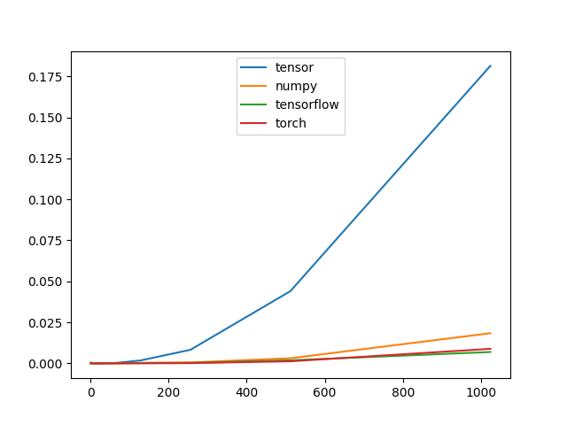

# gemm

## benchmark

### [api](./python/benchmark/benchmark_api.py)


- basic

```
           basic
┏━━━━━━━━━━━┳━━━━━━━━━━━━━┓
┃ scale (n) ┃ latency (s) ┃
┡━━━━━━━━━━━╇━━━━━━━━━━━━━┩
│         1 │           0 │
│         2 │           0 │
│         4 │           0 │
│         8 │           0 │
│        16 │           0 │
│        32 │    3.13E-05 │
│        64 │    2.50E-04 │
│       128 │    2.03E-03 │
│       256 │      0.0185 │
│       512 │       0.242 │
│      1024 │        2.57 │
└───────────┴─────────────┘
```

- order

```
           order
┏━━━━━━━━━━━┳━━━━━━━━━━━━━┓
┃ scale (n) ┃ latency (s) ┃
┡━━━━━━━━━━━╇━━━━━━━━━━━━━┩
│         1 │           0 │
│         2 │           0 │
│         4 │           0 │
│         8 │           0 │
│        16 │           0 │
│        32 │    3.13E-05 │
│        64 │    1.25E-04 │
│       128 │    1.09E-03 │
│       256 │    8.75E-03 │
│       512 │      0.0749 │
│      1024 │       0.571 │
└───────────┴─────────────┘
```

- tile

```
           tile
┏━━━━━━━━━━━┳━━━━━━━━━━━━━┓
┃ scale (n) ┃ latency (s) ┃
┡━━━━━━━━━━━╇━━━━━━━━━━━━━┩
│         1 │           0 │
│         2 │    3.13E-05 │
│         4 │           0 │
│         8 │           0 │
│        16 │           0 │
│        32 │    3.12E-05 │
│        64 │    1.56E-04 │
│       128 │    1.13E-03 │
│       256 │    8.34E-03 │
│       512 │      0.0835 │
│      1024 │       0.654 │
└───────────┴─────────────┘
```

- parallel

```
         parallel
┏━━━━━━━━━━━┳━━━━━━━━━━━━━┓
┃ scale (n) ┃ latency (s) ┃
┡━━━━━━━━━━━╇━━━━━━━━━━━━━┩
│         1 │    6.25E-05 │
│         2 │           0 │
│         4 │           0 │
│         8 │    3.12E-05 │
│        16 │           0 │
│        32 │    3.12E-05 │
│        64 │    2.19E-04 │
│       128 │    1.03E-03 │
│       256 │    4.47E-03 │
│       512 │      0.0229 │
│      1024 │         0.2 │
└───────────┴─────────────┘
```

### [tensor](./python/benchmark/benchmark_tensor.py)



- tensor

```
          tensor
┏━━━━━━━━━━━┳━━━━━━━━━━━━━┓
┃ scale (n) ┃ latency (s) ┃
┡━━━━━━━━━━━╇━━━━━━━━━━━━━┩
│         1 │    9.38E-05 │
│         2 │    3.12E-05 │
│         4 │    3.13E-05 │
│         8 │    3.13E-05 │
│        16 │    3.12E-05 │
│        32 │    6.24E-05 │
│        64 │    2.50E-04 │
│       128 │    1.78E-03 │
│       256 │    8.28E-03 │
│       512 │       0.044 │
│      1024 │       0.181 │
└───────────┴─────────────┘
```

- numpy

```
           numpy
┏━━━━━━━━━━━┳━━━━━━━━━━━━━┓
┃ scale (n) ┃ latency (s) ┃
┡━━━━━━━━━━━╇━━━━━━━━━━━━━┩
│         1 │           0 │
│         2 │           0 │
│         4 │           0 │
│         8 │    3.12E-05 │
│        16 │           0 │
│        32 │           0 │
│        64 │    3.12E-05 │
│       128 │    3.13E-04 │
│       256 │    5.62E-04 │
│       512 │    3.12E-03 │
│      1024 │      0.0184 │
└───────────┴─────────────┘
```

- tensorflow

```
        tensorflow
┏━━━━━━━━━━━┳━━━━━━━━━━━━━┓
┃ scale (n) ┃ latency (s) ┃
┡━━━━━━━━━━━╇━━━━━━━━━━━━━┩
│         1 │    6.24E-05 │
│         2 │    5.94E-04 │
│         4 │    6.25E-05 │
│         8 │    6.25E-05 │
│        16 │    6.24E-05 │
│        32 │    6.25E-05 │
│        64 │    6.25E-05 │
│       128 │    1.88E-04 │
│       256 │    3.44E-04 │
│       512 │    1.87E-03 │
│      1024 │    6.94E-03 │
└───────────┴─────────────┘
```

- torch

```
           torch
┏━━━━━━━━━━━┳━━━━━━━━━━━━━┓
┃ scale (n) ┃ latency (s) ┃
┡━━━━━━━━━━━╇━━━━━━━━━━━━━┩
│         1 │    3.12E-05 │
│         2 │           0 │
│         4 │           0 │
│         8 │           0 │
│        16 │           0 │
│        32 │    3.12E-05 │
│        64 │    3.14E-05 │
│       128 │    3.12E-05 │
│       256 │    1.56E-04 │
│       512 │    1.28E-03 │
│      1024 │    8.87E-03 │
└───────────┴─────────────┘
```